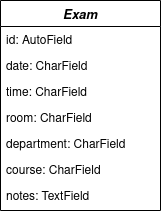

# AUEB Exams API

Providing a secure and easy way to query the Athens University of Economics and Business exam period information.

## Domain model

### Model entities

| Model entity | Description |
| :----------- | :---------- |
| Exams | Entity representing a single examination date. Holds information about the exam's date, time and location. |

### Diagram

### API endpoints

Exam model endpoints

* /api/exams
* /api/exams?date=\<date\> : *date* is a "DDMMYYYY" string
* /api/exams?department=\<department\> : *department* is a string
* /api/exams?professor=\<professor\> : *professor* is a string
* /api/exams?course=\<course\> : *course* is a string
* Plus all possible combinations of the above query parameters.

## Services provided

The main goal of the project is to provide a functional and secure API for the university's *exams* table. Apart from that, the project aims to deliver more amenities that increase the ease of use and the overall quality.

### API

As mentioned above, the API constitutes the central functionality of this effort and should thus be mentioned first. Using a series of endpoints, the API allows its users to query the different examination dates hosted by the university. A single *token*, which is delivered by the university to the end-users, is used to authenticate all incoming connections. Lastly, all logic was written using the [Django REST framework](https://www.django-rest-framework.org/).

### Logger

In order to safeguard the API from malicious requests, a logger is used to document all traffic heading to the API. This is achieved by means of an additional *middleware*, named the *RequestLogMiddleware*, which monitors all incoming traffic.

### Documentation

##### Note: Not yet implemented.

The proper way to utilize the API is detailed online, at a hosted webpage. Moreover, the present article which you've just read, constitutes an additional introduction to the API and its inner workings.
